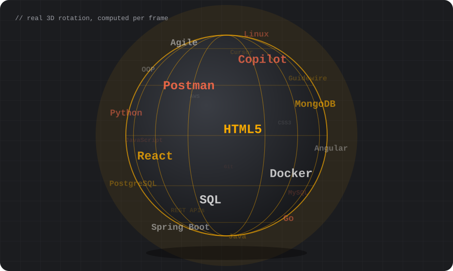
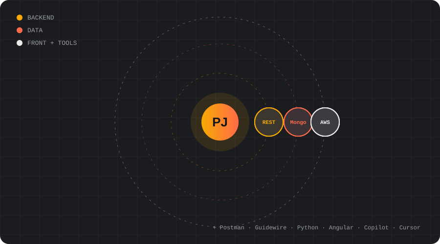
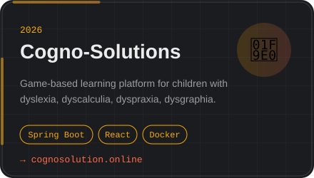
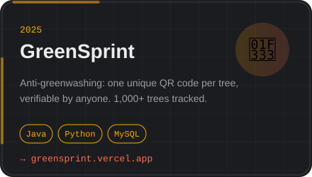

  

  

  
  
  

<h3>🤖 &nbsp;meet the PJ-bot</h3>

<h3>⌨️ &nbsp;boot sequence</h3>

<h3>🌐 &nbsp;the stack globe</h3>

<h3>🪐 &nbsp;my tech universe</h3>

<h3>🏆 &nbsp;hackathon wall of fame</h3>

20 hackathons entered · 13 wins · Top 5 international finish in Malaysia

<h3>🚀 &nbsp;things i've built</h3>

  
  

<h3>🌿 &nbsp;git log --journey</h3>

<h3>📊 &nbsp;the numbers</h3>

  
  

  

Open to collaborations and hackathon teams · <a href="mailto:piyushaundhekar@gmail.com">say hi</a>

